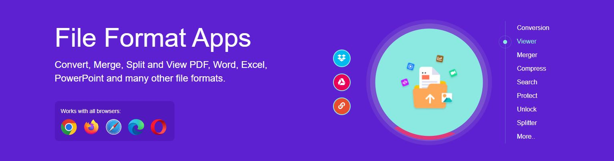
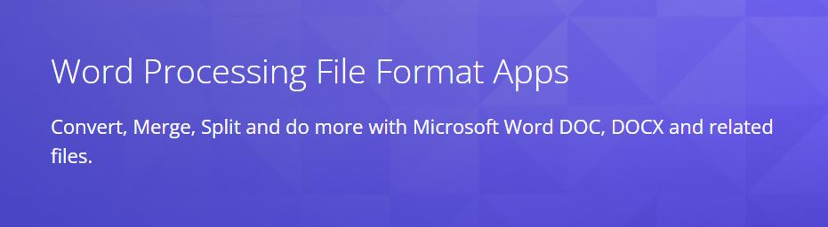
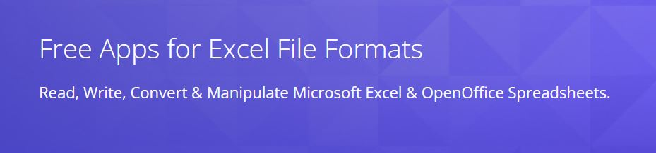
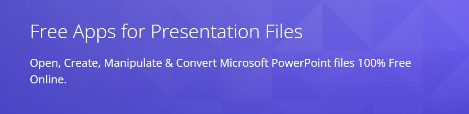

We are excited to announce the launch of new website, fileformat.app. The purpose of fileformat.app is to provide free tools for a wide variety of file formats.

## Which file formats are we talking about?

Even at the initial launch stage, we cover almost all files which you use regularly. Below is the brief overview of supported file formats.

### Word Processing Documents

All files that can be opened in Microsoft Office Word. These include DOCX, DOC, RTF, DOCM, DOT, DOTX etc.

Since you know that there are open source alternatives to the MS Office such as Apache OpenOffice and LibreOffice. Their Word Processor (writer) works with Open Document Format types, which is ODT. 

With fileformat.app, you can easily convert, view, split, merge and do a lot of other operations with the MS Word and Open Office files.

Here are some of our word processing apps.

- [Convert Word Documents](https://products.fileformat.app/word-processing/conversion/)
- [Word Document Merger](https://products.fileformat.app/word-processing/merger/)
- [Sign Word Documents](https://products.fileformat.app/word-processing/signature/)
- [All Word Processing Apps](https://products.fileformat.app/word-processing/)

### Spreadsheet Files

Spreadsheet files supported by Microsoft Office Excel are XLS, XLSX, XLSM, XLSB, CSV etc. We have online viewers, converters, splitter, merger and signature apps for these file types.

Open Office Calc works on ODS file by default. If you have got one and do not have (or want to install) Open Office, just to view the contents, you can use our free apps to view. Or may be convert it to Excel format and use it as you like.

Below is the list of few Spreadsheet apps.

- [Convert Spreadsheet files](https://products.fileformat.app/spreadsheet/conversion/)
- [Spreadsheet Merger](https://products.fileformat.app/spreadsheet/merger/)
- [Add Watermark in Spreadsheet](https://products.fileformat.app/spreadsheet/watermark/)
- [All Spreadsheet Apps](https://products.fileformat.app/spreadsheet/)

### Presentation Files

PPT and PPTX file types can be opened in Microsoft Office PowerPoint. You can convert, view, split, merge, add signatures and do a lot more, for free, at fileformat.app.

And of course we also support ODP, which is an open source file type for Open Office Imress.

And here goes few apps which work on the presentation files.

- [Convert Presentation files](https://products.fileformat.app/presentation/conversion/)
- [Split Presentations](https://products.fileformat.app/presentation/splitter/)
- [View Presentations online](https://products.fileformat.app/presentation/viewer/)
- [All Presentation Apps](https://products.fileformat.app/presentation/)

More information on the the other apps soon. 